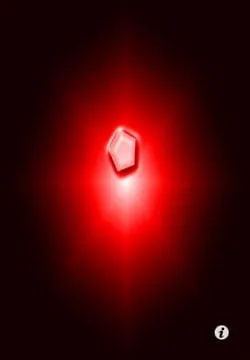

<div align="center">

# 💎 I Am Rich

**The classic Flutter starter app — rebuilt with modern Material 3 theming.**



[](https://flutter.dev)
[](https://dart.dev)
[](LICENSE)

</div>

---

## 🇬🇧 English

One of the very first Flutter apps I ever built — the famous **"I Am Rich"** app from the classic Flutter bootcamp curriculum. It deliberately does almost nothing: it shows a diamond. And that's exactly why it's a great first app — it teaches you that *any* UI, no matter how simple, is built from the same three building blocks: **widgets, layout, and assets**.

I keep it on my profile as a milestone — and I've since revisited the code to modernize it with current Flutter best practices.

### ✨ What's inside

| Concept | Where it lives |
|---|---|
| `StatelessWidget` & immutable widget trees | `lib/main.dart` |
| `MaterialApp` + Material 3 `ColorScheme.fromSeed` theming | `lib/main.dart` |
| `Scaffold` / `AppBar` / `Center` layout primitives | `lib/main.dart` |
| Bundling & loading image assets | `pubspec.yaml`, `assets/images/` |
| A smoke test with `flutter_test` | `test/widget_test.dart` |

### 🚀 Run it

```bash
flutter pub get
flutter run
```

### 🧪 Test it

```bash
flutter test
```

---

## 🇮🇷 فارسی

یکی از اولین اپ‌هایی که با Flutter ساختم — اپ معروف **«I Am Rich»** از دوره‌های آموزشی کلاسیک فلاتر. این اپ عمداً هیچ کاری نمی‌کند: فقط یک الماس نشان می‌دهد. و دقیقاً به همین دلیل اپ خوبی برای شروع است — یاد می‌دهد که هر رابط کاربری، هرقدر هم ساده، از سه چیز ساخته می‌شود: **ویجت، چیدمان و فایل‌های همراه (assets)**.

این ریپو را به‌عنوان یک سند مقدماتی نگه داشته‌ام و بعداً کدش را با استانداردهای روز Flutter بازنویسی کرده‌ام.

### ✨ چه چیزهایی در آن هست

| مفهوم | محل استفاده |
|---|---|
| ویجت‌های بدون وضعیت (`StatelessWidget`) | `lib/main.dart` |
| تم‌پردازی Material 3 با `ColorScheme.fromSeed` | `lib/main.dart` |
| اجزای پایه چیدمان `Scaffold` / `AppBar` / `Center` | `lib/main.dart` |
| بارگذاری تصویر از assets | `pubspec.yaml` و `assets/images/` |
| تست اسموک با `flutter_test` | `test/widget_test.dart` |

### 🚀 اجرا

```bash
flutter pub get
flutter run
```

---

<div align="center">

**Built with Flutter · Maintained by [Parsa Fathi](https://github.com/ParsaFathii)**

</div>
